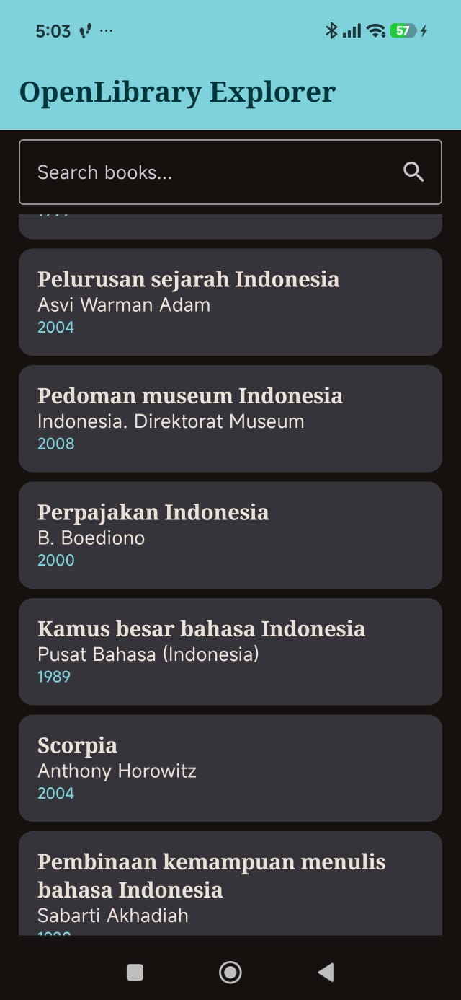

# OpenLibrary Explorer

Aplikasi mobile Android untuk mencari dan mengeksplorasi katalog buku dari OpenLibrary REST API. Dibuat dengan Kotlin dan Jetpack Compose menggunakan arsitektur MVVM.

**Nama:** Farrel Athalladhia Rivaldimuchlis  
**NIM:** H1D024054  
**Mata Kuliah:** Mobile Programming (Responsi, Paket 2)

## Screenshot

| Home Screen | Detail Screen |
|-------------|---------------|
|  |  |

## Fitur

- Pencarian buku berdasarkan kata kunci (parameter `q` pada API)
- Daftar buku menggunakan `LazyColumn` (judul, nama penulis, tahun terbit pertama)
- Loading state (indikator progres saat data dimuat)
- Error state dengan tombol Retry (misalnya saat tidak ada internet)
- Halaman detail: judul, penulis, tahun terbit pertama, jumlah edisi, dan bahasa
- Tombol back pada halaman detail
- Tema Material Design 3 dengan color scheme Light dan Dark, serta typography kustom
- Tanpa gambar dan tanpa library gambar

## Arsitektur

Aplikasi memakai pola **MVVM**:

```
View (Composable) -> ViewModel -> Repository -> Retrofit API Service -> OpenLibrary API
```

| Lapisan | File | Peran |
|---------|------|-------|
| View | `HomeScreen`, `DetailScreen`, `BookItem`, `BookSearchBar`, `StatusViews` | Menampilkan UI sesuai state, tanpa memanggil API |
| ViewModel | `BookViewModel` | Menyimpan state dalam `StateFlow`, menjalankan pencarian |
| State | `BookUiState` | Sealed class: `Loading`, `Success`, `Error` |
| Repository | `BookRepository` | Memanggil API dan menyaring data |
| API Service | `OpenLibraryApi`, `RetrofitInstance` | Konfigurasi Retrofit + converter Gson |
| Data Model | `Book`, `SearchResponse` | Data class hasil parsing JSON |

### Alur data

1. Pengguna mengetik kata kunci, lalu `BookViewModel.searchBooks()` dipanggil.
2. State berubah menjadi `Loading`.
3. Repository memanggil API lewat Retrofit.
4. Hasil dikirim kembali, lalu state menjadi `Success(books)` atau `Error(message)`.
5. Composable mengamati `StateFlow` dan menampilkan UI sesuai state.

### Navigasi

- Memakai `navigation-compose` dengan 2 screen: `home` dan `detail/{bookKey}`.
- Saat buku diklik, `key` buku diteruskan sebagai argumen navigasi.
- Halaman detail mengambil data buku dari daftar yang sudah dimuat di ViewModel (`getBookByKey`), sehingga **tidak ada API call kedua**.

## API

- **Sumber:** [OpenLibrary Search API](https://openlibrary.org/developers/api)
- **Base URL:** `https://openlibrary.org/`
- **Endpoint:** `GET /search.json?q={keyword}&limit=20`
- **Contoh:** https://openlibrary.org/search.json?q=indonesia&limit=20
- **API Key:** tidak diperlukan

Field yang digunakan dari `docs[]`: `key`, `title`, `author_name`, `first_publish_year`, `edition_count`, `language`.

Semua field dibuat nullable karena tidak semua buku memiliki data lengkap. Field `cover_i` diabaikan.

## Teknis

### Teknologi

- Bahasa: Kotlin
- UI: Jetpack Compose, Material Design 3, `Scaffold` + `TopAppBar`
- Networking: Retrofit + converter-gson
- Navigasi: navigation-compose
- State: lifecycle-viewmodel-compose, `StateFlow`

### Library tambahan yang digunakan

Hanya library yang diizinkan:

- `retrofit`
- `converter-gson`
- `navigation-compose`
- `lifecycle-viewmodel-compose`

### Penerapan konsep Kotlin

- **Data class:** `Book`, `SearchResponse`
- **Null safety:** `?.`, `?:`, `orEmpty()`, field nullable
- **Lambda:** `onBookClick: (Book) -> Unit`
- **Extension function:** `List<String>?.toDisplayText()`

### Struktur proyek

```
app/src/main/java/com/example/openlibrary/
├── MainActivity.kt
├── data/
│   ├── model/Book.kt
│   ├── remote/OpenLibraryApi.kt
│   ├── remote/RetrofitInstance.kt
│   └── repository/BookRepository.kt
└── ui/
    ├── BookUiState.kt
    ├── BookViewModel.kt
    ├── navigation/AppNavigation.kt
    ├── screen/HomeScreen.kt
    ├── screen/DetailScreen.kt
    ├── components/BookItem.kt
    ├── components/SearchBar.kt
    ├── components/StatusViews.kt
    └── theme/Color.kt, Theme.kt, Type.kt
```

### Cara menjalankan

1. Clone repository ini.
2. Buka dengan Android Studio, lalu tunggu Gradle sync selesai.
3. Pastikan perangkat atau emulator terhubung ke internet.
4. Klik tombol Run.

Atau install langsung file APK debug: [`app-debug.apk`](app/build/outputs/apk/androidTest/debug/app-debug-androidTest.apk)

## Video Penjelasan Kode

[Link video YouTube](https://youtu.be/ZYXbp5wZScQ)
